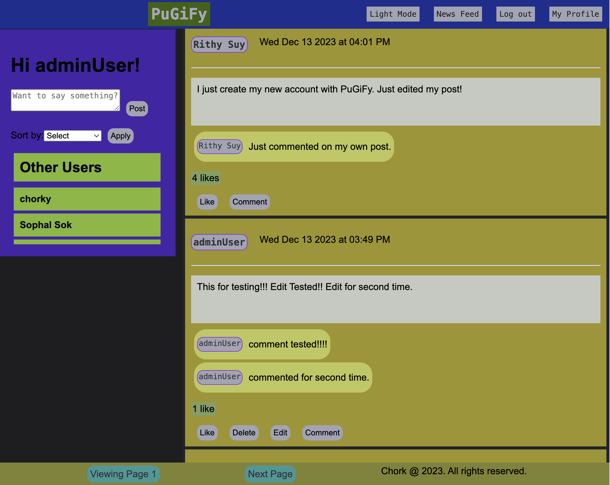
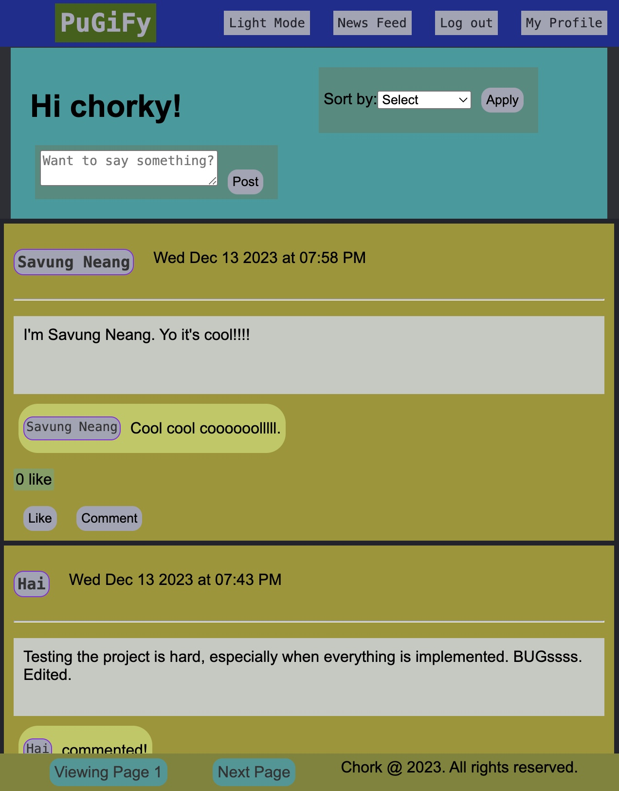
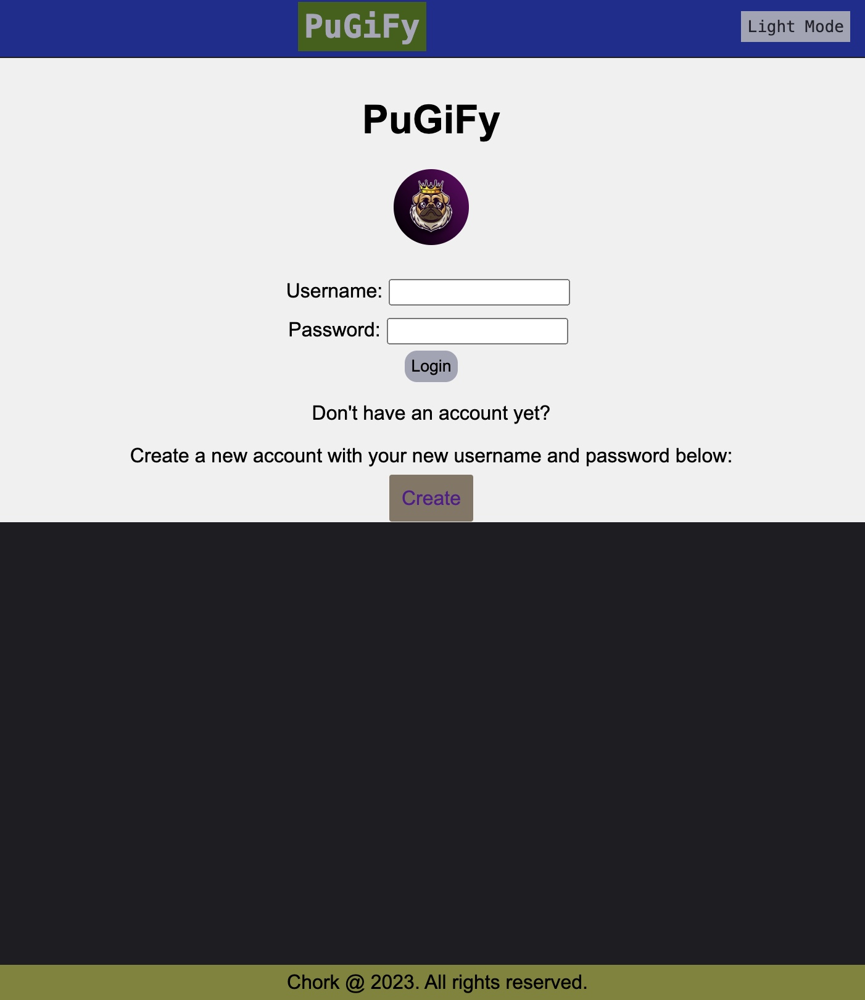
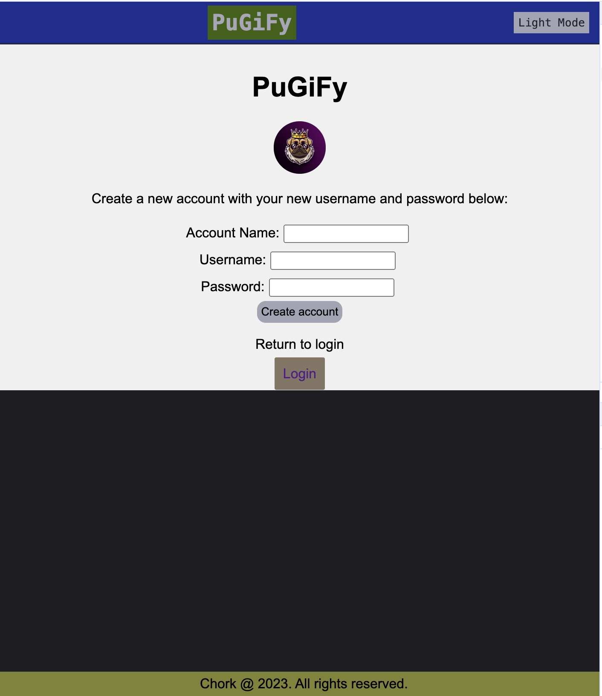
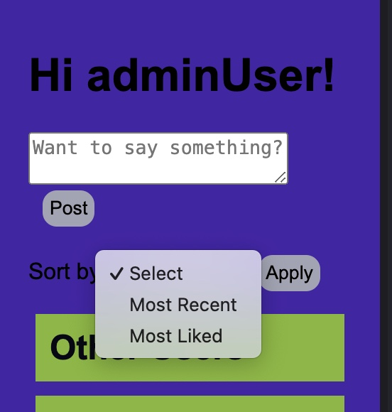

# PuGiFy Connect
This is a simple social media platform
## Some functionalities for this website
### Login and account creation features
When the users try to access this website, there will be a login page that has two options (login with username and password, or create a new account). Notice that there is no email or personal information required here, and users can just create their own username and password to have access to the site.  
In the `login` page, you can also choose `create` option to create a new account. After a new account is created successfully, you can return `login` page and log in through your new `username` and `password`. 

### User interaction
Users can post and edit, comment on post(s), and like posted content(s). However, post editing or deleting is associated only with specific user, which mean users can only edit and delete their post(s).
- Users can comment and like any post, but they are not allowed to edit or delete other users' posts.
- Users can edit or delete their post(s) if they are the author of that post.
- Users can create a new post as desired.
- Users can also sort posts by `newest posts` or by `like count`.
- Current user will be able to see their profile page.
- Current logged-in user will have a `log out` option when they want to sign out of the website.

### Back-end and Data Storage
This site uses `mysql` for managing database and back-end of the server.
- Users Information: For this project users' data contains `user id`, `username`, and `password`.
- Posts: Each post has `post date-time`, `post content`, `post id`, `author's id`, and `like count` associated with it.
- Comments: Each comment is associated with `post id` and `author id` along with `commenter id`.

## How to run this program
### Requirement
Make sure you `expressjs` and `pug` installed other `npm` installation packages  
Some libaries you might need:
- `bcrypt` libaries for password hashing and encryption
- `express-session` libaries is good when handling with multiple users
- You must use `tables` described in `schema.sql` to create tables for this project to ensure that you get right project to run.
### Get it to work
This instruction requires you to run the program using you `database` account by re
- Open a terminal in the project folder and run the following command:
    ```
    node server.js
    ```
    This will run the `server` for the website
- On your browser, go to the following site:
    ```
    localhost:8000
    ```
    Now you see the login page that allows your to login or create a new account.

## Enjoy PuGiFy
Large Screen Mode

Small Screen Mode

Login Page

Account Creation Page

See Posts by Options (latest or most liked)


Enjoy 😘